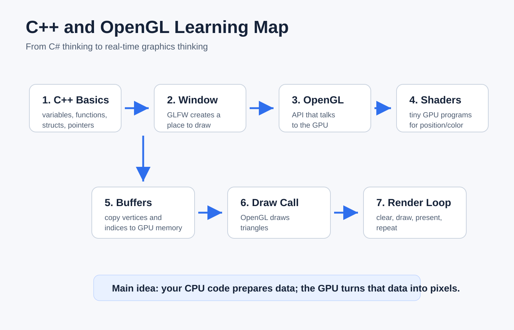
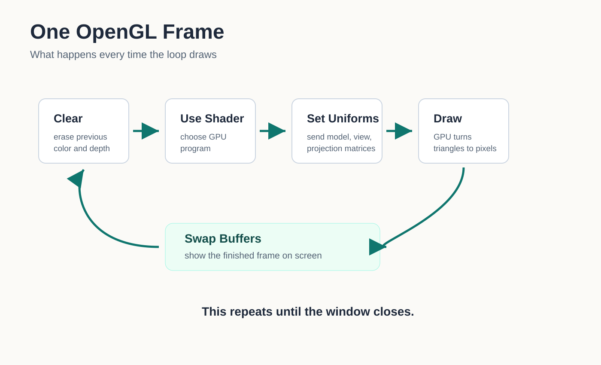
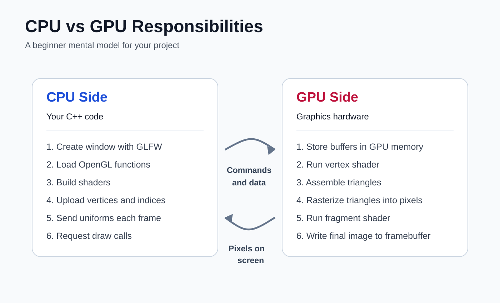
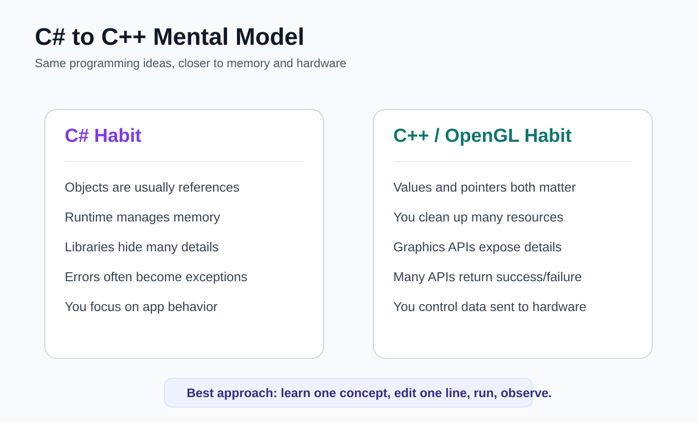

# My C++ and OpenGL Learning Journey

This document is written for someone coming from C# and learning C++ plus OpenGL from zero.

The goal is not to memorize everything. The goal is to understand the story:

1. C++ runs your application code.
2. GLFW creates a window and gives OpenGL a place to draw.
3. OpenGL talks to the GPU.
4. Shaders are tiny programs that run on the GPU.
5. Buffers store data such as cube positions.
6. The render loop redraws the scene many times per second.

## Infographics









## Step 1: What C++ Is Doing

C++ is the language running your program. It is similar to C# in some ideas:

| C# idea | C++ idea | Meaning |
| --- | --- | --- |
| `class` / `struct` | `class` / `struct` | A type that groups data and behavior |
| `using System;` | `#include <iostream>` | Bring code from another file/library |
| `const` | `const` / `constexpr` | A value that should not change |
| `null` | `nullptr` | No object / no pointer |
| `Console.WriteLine` | `std::cout` / `std::cerr` | Print text |
| Garbage collector | Manual cleanup / RAII | You often decide when resources are freed |

The biggest difference: C++ lets you work closer to memory and hardware.

In C#, objects are usually references managed by the runtime. In C++, you can have:

```cpp
int number = 10;        // A normal value
int* pointer = nullptr; // A variable that can point to an int
```

For now, do not worry about mastering pointers. In this project, GLFW gives us a pointer:

```cpp
GLFWwindow* window = createWindow();
```

Read this as:

> `window` is a handle to a GLFW window object.

## Step 2: What OpenGL Is

OpenGL is an API for asking the GPU to draw things.

OpenGL is not a game engine. It does not know about players, enemies, cameras, or worlds.

OpenGL knows lower-level drawing ideas:

- vertices
- triangles
- buffers
- shaders
- textures
- uniforms
- draw calls

Your code prepares data. The GPU draws it.

## Step 3: Why We Need GLFW

OpenGL draws into a context, but it does not create a Windows desktop window by itself.

GLFW helps with:

- creating the app window
- creating the OpenGL context
- handling keyboard/mouse/window events
- swapping the back buffer to the screen

This line starts GLFW:

```cpp
glfwInit();
```

This line creates a window:

```cpp
GLFWwindow* window = glfwCreateWindow(1920, 1080, "LearnOpenGL", nullptr, nullptr);
```

This line says: "Make this window the active place OpenGL draws to."

```cpp
glfwMakeContextCurrent(window);
```

## Step 4: The Render Loop

Almost every real-time graphics program has a loop like this:

```cpp
while (!glfwWindowShouldClose(window))
{
    renderFrame(shaderProgram, uniforms, cube);

    glfwSwapBuffers(window);
    glfwPollEvents();
}
```

Read it like C# pseudocode:

```csharp
while (window.IsOpen)
{
    DrawOneFrame();
    ShowTheFrameOnScreen();
    ProcessInputAndWindowEvents();
}
```

The screen is redrawn again and again. If the cube changes a little each frame, it looks animated.

## Step 5: Vertices and Indices

A vertex is a point in 3D space.

This project stores 8 cube corners:

```cpp
const std::array<float, 24> vertices = {
    -0.5f, -0.5f, -0.5f,
     0.5f, -0.5f, -0.5f,
     // more positions...
};
```

Each vertex has 3 numbers:

- x
- y
- z

An index tells OpenGL which vertices form triangles.

```cpp
const std::array<unsigned int, 36> indices = {
    0, 1, 2, 2, 3, 0
};
```

That means:

- triangle 1 uses vertices 0, 1, 2
- triangle 2 uses vertices 2, 3, 0

A cube has 6 faces. Each face is 2 triangles. So:

```text
6 faces * 2 triangles * 3 points = 36 indices
```

## Step 6: Buffers

Buffers are GPU memory containers.

In C# terms, imagine copying an array from your app into the graphics card:

```cpp
glBufferData(GL_ARRAY_BUFFER, sizeof(vertices), vertices.data(), GL_STATIC_DRAW);
```

That means:

> Copy my vertex array into the GPU. I will use it for drawing and probably will not change it often.

The project uses:

- `vertexBuffer`: stores cube corner positions
- `indexBuffer`: stores the order for drawing triangles
- `vertexArray`: remembers how the vertex data is arranged

## Step 7: Shaders

Shaders are small programs that run on the GPU.

The vertex shader runs once per vertex:

```glsl
gl_Position = projection * view * model * vec4(position, 1.0);
```

Its job is to move 3D points into screen space.

The fragment shader runs for pixels:

```glsl
fragmentColor = vec4(0.15, 0.65, 1.0, 1.0);
```

Its job is to choose a color.

## Step 8: Model, View, Projection

These three matrices answer three questions:

| Matrix | Question | In this project |
| --- | --- | --- |
| Model | Where is the object? | Rotate the cube |
| View | Where is the camera? | Move the scene away from camera |
| Projection | How does 3D become screen? | Perspective camera |

This line rotates the cube over time:

```cpp
const Matrix4 model = createYRotationMatrix(static_cast<float>(glfwGetTime()));
```

`glfwGetTime()` returns how many seconds have passed. As time changes, the rotation changes.

## Step 9: Cleanup

OpenGL objects live on the GPU. C++ will not automatically delete them for you.

That is why the code ends with:

```cpp
deleteCubeGeometry(cube);
glDeleteProgram(shaderProgram);
glfwDestroyWindow(window);
glfwTerminate();
```

Read this as:

> I am finished with these resources, so I am giving them back.

## Suggested Study Order

1. Learn basic C++ syntax: variables, functions, structs, arrays.
2. Learn pointers only enough to understand handles like `GLFWwindow*`.
3. Understand the render loop.
4. Understand vertices and triangles.
5. Understand buffers: VAO, VBO, EBO.
6. Understand shaders.
7. Understand model/view/projection matrices.
8. Add one new feature at a time: color, input, camera, texture, lighting.

## Mini Exercises

Try these in order:

1. Change the window title.
2. Change the background color in `glClearColor`.
3. Change the cube color in the fragment shader.
4. Change the camera distance from `-10.0f` to `-4.0f`.
5. Change the rotation speed by multiplying `glfwGetTime()`.
6. Add comments in your own words above every function.

Your documentation will grow best if you write one small note after each exercise:

```text
Today I changed ____. I expected ____. I saw ____. I learned ____.
```
